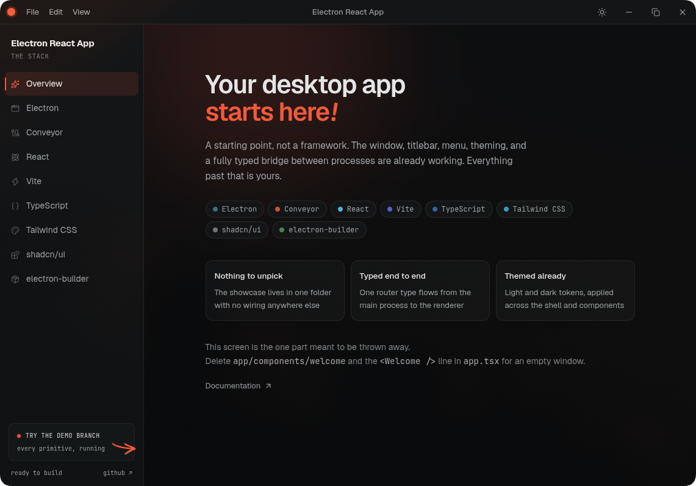

# Electron React App

A modern Electron starter kit with React, Vite, TypeScript and TailwindCSS, built around
**[electron-conveyor](https://github.com/guasam/electron-conveyor)** for type-safe IPC and
cross-window state.

<br />

<p align="center">
    
</p>

<br />

<div align="center">

 &nbsp;
 &nbsp;
 &nbsp;
 &nbsp;
 &nbsp;


</div>

<br />

## Stack

🔹 **[Electron](https://www.electronjs.org)** - Cross-platform desktop application framework.<br />
🔹 **[React](https://react.dev)** - The library for web and native user interfaces.<br />
🔹 **[electron-conveyor](https://github.com/guasam/electron-conveyor)** - Type-safe IPC + cross-window state.<br />
🔹 **[TypeScript](https://www.typescriptlang.org)** - Type-safe JavaScript.<br />
🔹 **[Shadcn UI](https://ui.shadcn.com)** - Beautiful and accessible component library.<br />
🔹 **[TailwindCSS](https://tailwindcss.com)** - Utility-first CSS framework.<br />
🔹 **[Electron Vite](https://electron-vite.org)** - Lightning-fast build tool based on **Vite** for fastest hot-reload.<br />
🔹 **[Electron Builder](https://www.electron.build/index.html)** - Configured for packaging applications.<br />

<br />

## What you get

|                         |                                                                                                                   |
| ----------------------- | ----------------------------------------------------------------------------------------------------------------- |
| **Typed IPC**           | Queries, commands, streams and events with end-to-end inference. No channel strings, no hand-written API classes. |
| **Cross-window stores** | Main-owned state synced live across every window, with opt-in persistence.                                        |
| **Sandboxed renderer**  | `sandbox: true` out of the box. The conveyor preload is sandbox-compatible.                                       |
| **Custom window shell** | Themed frame, titlebar and menu system you can style however you want.                                            |
| **Demo branch**         | A live playground of every primitive on `demo`, while `main` stays minimal.                                       |
| **The usual tooling**   | Vite HMR, Shadcn UI, Tailwind, ESLint and Prettier, VS Code debug configs, `res://` protocol, import aliases.     |

<br />

## Quick start

```bash
git clone https://github.com/guasam/electron-react-app
cd electron-react-app

# any package manager works: npm, yarn, pnpm, bun
npm install
npm run dev
```

That starts Electron with hot reload. `main` is deliberately minimal (a themed window frame,
titlebar, menus and the typed IPC layer) so you can start building on top of it right away.

### Removing the welcome screen

The window opens on a short tour of the stack. It is the one piece meant to be thrown away, and it
is built so that removing it costs nothing: it lives entirely in `app/components/welcome`, nothing
else imports it, and it adds no IPC modules of its own.

```bash
rm -rf app/components/welcome
```

Then drop the `<Welcome />` line and its import from `app/app.tsx`. What is left is an empty window
with the shell still around it, ready for your app.

### Try the demo

Want to see everything the stack can do first? The **`demo`** branch is an interactive playground of
every IPC primitive (cross-window state, streaming, background tasks, middleware), with the real
source behind each demo:

```bash
git switch demo
npm install
npm run dev
```

Switch back to `main` and re-run `npm install` when you are ready to build.

<br />

## Conveyor: Type-safe IPC

IPC is powered by [electron-conveyor](https://github.com/guasam/electron-conveyor). One definition
in main is the single source of truth for a feature, and the renderer client is _inferred_ from it.

| You want                          | Use             | Renderer side                                             |
| --------------------------------- | --------------- | --------------------------------------------------------- |
| Read something from main          | `query()`       | `await conveyor.x.y()` or `.useQuery()`                   |
| Tell main to do something         | `command()`     | `await conveyor.x.y()` or `.useMutation()`                |
| Chunks pushed as they're produced | `stream()`      | `for await (const c of conveyor.x.y())` or `.useStream()` |
| Main pushing to the renderer      | `event()`       | `conveyor.x.y.subscribe(cb)` or `.useEvent(cb)`           |
| State shared live across windows  | `defineStore()` | `useConveyorStore(store)`                                 |

### Adding a feature takes two edits

**1. Define the module** in `conveyor/modules/`:

```ts
// conveyor/modules/notes.ts — runs in MAIN only
import { z } from 'zod'
import { defineModule, query, command } from '../init'

export const notesModule = defineModule({
  list: query(() => readNotes()),

  // input crosses the trust boundary → schema required, validated on every call
  save: command(z.object({ title: z.string(), body: z.string() }), ({ input }) => saveNote(input)),
})
```

**2. Register it** in `conveyor/router.ts`:

```ts
export const router = createRouter(
  {
    window: windowModule,
    web: webModule,
    notes: notesModule, // ← the key becomes the module id
  },
  { createContext, use: [devLogger] }
)
```

That's it. The renderer client already knows it, fully typed:

```tsx
import { conveyor } from '@/conveyor/client'

function Notes() {
  const notes = conveyor.notes.list.useQuery() // key derived from the path — never hand-written
  const save = conveyor.notes.save.useMutation({
    onSuccess: () => conveyor.notes.list.invalidate(),
  })

  return <button onClick={() => save.mutate({ title: 'Hi', body: '...' })}>Save</button>
}
```

Outside React, every member is a plain typed call: `await conveyor.notes.list()`.

### Errors

Failures re-throw in the renderer as `ConveyorError` with a stable `code`. Conveyor reserves
`UNKNOWN_PROCEDURE`, `INVALID_INPUT`, `INVALID_OUTPUT` and `HANDLER_ERROR`; anything your handler
throws deliberately keeps its own code:

```ts
// main
throw new ConveyorError('LOCKED', 'Unlock the vault first')

// renderer
try {
  await conveyor.vault.open()
} catch (err) {
  if (err instanceof ConveyorError && err.code === 'LOCKED') promptUnlock()
}
```

Branch on `err.code`, never on message strings. Validation failures also carry `err.issues` with
the Standard Schema detail, so you can map them onto form fields. The `demo` branch's
**Middleware** page has a working example.

> **Streams, Events, Middleware and the full Conveyor API reference** live in the
> **[electron-conveyor](https://github.com/guasam/electron-conveyor)** repo, and our `demo` branch
> has a working example for each one.

<br />

## Window shell

The starter kit ships a custom window implementation: titlebar with app icon, window controls,
a menu system with keyboard shortcuts, and a dark/light toggle. It works on Windows, macOS and
Linux.

The titlebar menu toggles with `Alt` on Windows and Linux, `Option (⌥)` on macOS. Edit the items in
`app/shell/menu.ts`.

<br />

## Project layout

### `app/` - renderer process

The React application that runs in the browser window. `app/shell/` holds the titlebar, menus,
window frame and theme.

### `conveyor/` - the IPC surface

- `init.ts` - authoring primitives bound to the app's context
- `modules/` - feature modules (**main-process only**; the renderer imports only `type AppRouter`)
- `router.ts` - the single registration point for modules, stores, middleware and context
- `client.ts` - the typed renderer client with hooks

### `lib/main/` - main process

Window creation (`app.ts`, with the window manager), app lifecycle, and the `res://` protocol.

### `lib/preload/` - preload script

An import and one call that expose the conveyor bridge. It never changes as your API grows, and it
is sandbox-compatible, so the renderer can run with `sandbox: true`.

<br />

## Path aliases

```ts
import { Button } from '@/app/components/ui/button'
import { conveyor } from '@/conveyor/client'
```

| Alias          | Points to                      |
| -------------- | ------------------------------ |
| `@/app/`       | `app/` (renderer)              |
| `@/lib/`       | `lib/` (main + preload)        |
| `@/conveyor/`  | `conveyor/` (the IPC surface)  |
| `@/resources/` | `resources/` (build resources) |

<br />

## Checks

```bash
npm run typecheck
npm run lint
npm run format
```

<br />

## Building for production

```bash
npm run build:win     # Windows
npm run build:mac     # macOS
npm run build:linux   # Linux
npm run build:unpack  # unpacked, all platforms
```

Distribution files land in the `dist` directory.
